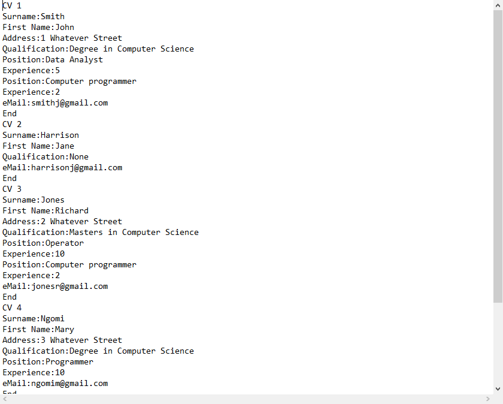

# CleaningUp - A Basic CV Clean Up Tool

 
 
 
This is simple utility tool made to showcase object-oriented programming as a part of my studies at the University of Birmingham. Simply provide the tool "dirty" CV's and it wll parse the information and provide a cleaner text document. It also has the ability to separate the parsed information with additional parameters, such as years of experience or having a degree or not. 
